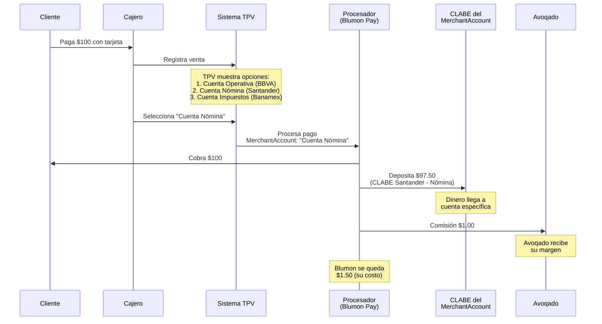
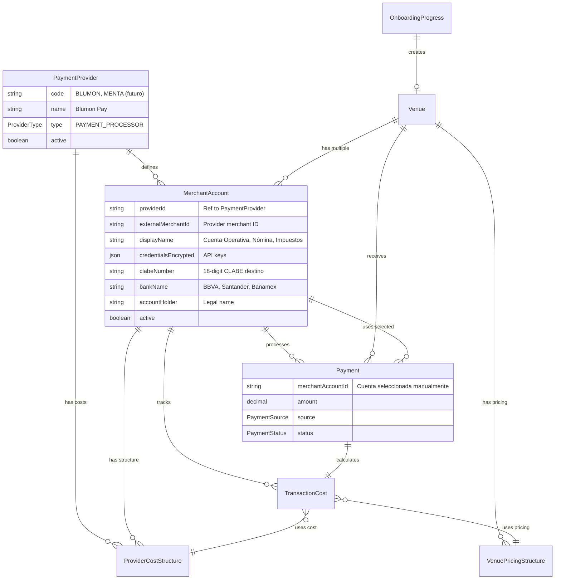
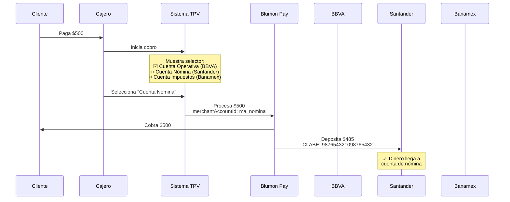
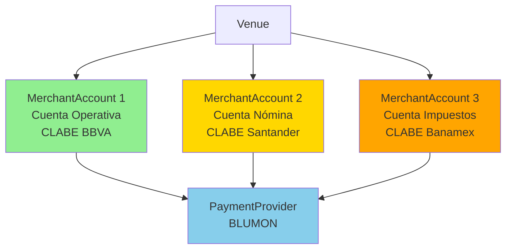

# Payment Architecture - Avoqado

## 📚 Table of Contents

1. [Introduction & Context](#introduction--context)
2. [Money Flow Diagram](#money-flow-diagram)
3. [Data Models Architecture](#data-models-architecture)
4. [Detailed Model Explanations](#detailed-model-explanations)
5. [Manual Account Selection (NOT Smart Routing)](#manual-account-selection-not-smart-routing)
6. [Profit Calculation](#profit-calculation)
7. [Current State (Blumon Pay Only)](#current-state-blumon-pay-only)
8. [Future State (Multiple Processors)](#future-state-multiple-processors)
9. [Onboarding Flow](#onboarding-flow)
10. [Common Use Cases](#common-use-cases)

---

## Introduction & Context

Avoqado es un **agregador comercial** (commercial associate), NO un procesador de pagos. Esto significa:

- ✅ Avoqado recolecta documentos KYC de venues
- ✅ Avoqado envía documentos a procesadores (Blumon Pay, Menta, etc.)
- ✅ Avoqado cobra **comisión/margen** sobre las transacciones
- ❌ Avoqado **NO maneja el dinero** de las transacciones
- ❌ Avoqado **NO deposita** a las cuentas de los venues

**Flujo de dinero real:**

```
Cliente → Procesador (Blumon) → CLABE del MerchantAccount seleccionado
                ↓
          Cobra comisión
                ↓
          Avoqado (margen)
```

**Ejemplo real:**

- Cliente paga $100 MXN con tarjeta
- Cajero selecciona "Cuenta Nómina"
- Procesador cobra 2.5% ($2.50 MXN) al venue
- De esos $2.50, el procesador cobra 1.5% a Avoqado ($1.50 MXN)
- Avoqado se queda con 1% de margen ($1.00 MXN)
- Venue recibe $97.50 en su CLABE de "Cuenta Nómina"

---

## Money Flow Diagram



**Punto crítico:** El cajero ELIGE manualmente a qué cuenta va el dinero. No hay routing automático.

---

## Data Models Architecture



---

## Detailed Model Explanations

### 1. PaymentProvider (Catálogo de Procesadores)

**Qué es:** Template/catálogo de procesadores disponibles.

**Estado actual:** Solo existe `BLUMON` (Blumon Pay).

**Ejemplo:**

```typescript
{
  code: "BLUMON",
  name: "Blumon Pay",
  type: "PAYMENT_PROCESSOR",
  active: true
}
```

---

### 2. MerchantAccount (Cuenta de Destino con CLABE)

**Qué es:** Cuenta bancaria específica donde se depositan los pagos. Cada MerchantAccount tiene su propia CLABE.

**✅ Punto crítico:** Un venue puede tener MÚLTIPLES MerchantAccounts con el MISMO procesador (Blumon), pero cada uno deposita a una CLABE
diferente.

**Ejemplo real - Venue con 3 cuentas:**

```typescript
// Todas usan Blumon Pay, pero CLABEs diferentes

MerchantAccount 1: {
  id: "ma_operativa",
  providerId: "blumon_id",  // ⬅️ Mismo procesador
  displayName: "Cuenta Operativa",
  clabeNumber: "012345678901234567", // BBVA
  bankName: "BBVA",
  active: true
}

MerchantAccount 2: {
  id: "ma_nomina",
  providerId: "blumon_id",  // ⬅️ Mismo procesador
  displayName: "Cuenta Nómina",
  clabeNumber: "987654321098765432", // Santander
  bankName: "Santander",
  active: true
}

MerchantAccount 3: {
  id: "ma_impuestos",
  providerId: "blumon_id",  // ⬅️ Mismo procesador
  displayName: "Cuenta Impuestos",
  clabeNumber: "567890123456789012", // Banamex
  bankName: "Banamex",
  active: true
}
```

**Uso:** Al cobrar, el cajero selecciona `ma_nomina` → el dinero se deposita en el Santander.

**¿Por qué múltiples cuentas con el mismo procesador?**

- Separar flujos de dinero (operación, nómina, impuestos, ahorros)
- Diferentes bancos para diferentes propósitos
- Contabilidad y auditoría más clara
- Control de liquidez por departamento

---

### 3. Payment (El Pago con Cuenta Seleccionada)

**Qué es:** Registro del pago que hizo el cliente, INCLUYENDO qué MerchantAccount usó.

**Nuevo campo crítico:** `merchantAccountId` - La cuenta que el cajero seleccionó manualmente.

```typescript
{
  id: "pay_abc123",
  amount: 500.00,
  merchantAccountId: "ma_nomina", // ⬅️ NUEVO: Cuenta seleccionada
  venueId: "venue_xyz",
  status: "COMPLETED",
  source: "TPV",
  createdAt: "2025-01-28T10:00:00Z"
}
```

**Flujo:**

1. Cajero cobra $500
2. Sistema muestra: "¿A qué cuenta depositar?"
3. Cajero elige "Cuenta Nómina" (`ma_nomina`)
4. Sistema guarda `merchantAccountId: "ma_nomina"`
5. Blumon deposita $485 a la CLABE de `ma_nomina` (Santander)

---

### 4. Liquidación por MerchantAccount

**Cómo se liquida al final del día/período:**

```typescript
// Reporte de liquidación
SELECT
  ma.displayName,
  ma.clabeNumber,
  ma.bankName,
  COUNT(p.id) AS transactionCount,
  SUM(p.amount) AS totalAmount
FROM Payment p
JOIN MerchantAccount ma ON p.merchantAccountId = ma.id
WHERE p.venueId = 'venue_xyz'
  AND p.createdAt >= '2025-01-28 00:00:00'
  AND p.createdAt < '2025-01-29 00:00:00'
  AND p.status = 'COMPLETED'
GROUP BY ma.id
ORDER BY totalAmount DESC
```

**Resultado:**

```
Cuenta Operativa (BBVA - 012345678901234567):
  45 transacciones = $12,500

Cuenta Nómina (Santander - 987654321098765432):
  12 transacciones = $3,800

Cuenta Impuestos (Banamex - 567890123456789012):
  8 transacciones = $2,100
```

**Cada monto se deposita a su CLABE correspondiente**.

---

## Manual Account Selection (NOT Smart Routing)

### ⚠️ ACLARACIÓN IMPORTANTE

**El sistema NO hace routing automático**. No hay reglas de BIN, montos, o failover.

**Lo que SÍ hace:**

- El cajero/mesero SELECCIONA MANUALMENTE la cuenta al momento del cobro
- Todas las cuentas usan el MISMO procesador (Blumon)
- Cada cuenta tiene su propia CLABE
- El dinero se deposita a la CLABE de la cuenta seleccionada

### Caso de Uso Real

**Escenario:** Restaurante quiere separar ingresos en 3 cuentas bancarias.

```
Venue "Mi Restaurante" configuración:
├─ MerchantAccount 1: "Cuenta Operativa"
│   ├─ Procesador: Blumon Pay
│   ├─ CLABE: 012345678901234567 (BBVA)
│   └─ Uso: Gastos diarios, proveedores, renta
│
├─ MerchantAccount 2: "Cuenta Nómina"
│   ├─ Procesador: Blumon Pay
│   ├─ CLABE: 987654321098765432 (Santander)
│   └─ Uso: Pago de sueldos (cada quincena)
│
└─ MerchantAccount 3: "Cuenta Impuestos"
    ├─ Procesador: Blumon Pay
    ├─ CLABE: 567890123456789012 (Banamex)
    └─ Uso: Apartar para SAT (IVA, ISR)
```

### Flujo de Pago con Selección Manual



### Implementación en el TPV (UI)

**Pantalla de cobro:**

```typescript
interface PaymentScreen {
  amount: 500
  customerName: 'Juan Pérez'
  paymentMethod: 'CARD'

  // Selector de cuenta
  availableAccounts: [
    {
      id: 'ma_operativa'
      displayName: 'Cuenta Operativa 💼'
      bank: 'BBVA'
      lastUsed: '2025-01-28 09:30'
      isDefault: true // Pre-seleccionada
    },
    {
      id: 'ma_nomina'
      displayName: 'Cuenta Nómina 👥'
      bank: 'Santander'
      lastUsed: '2025-01-27 18:00'
    },
    {
      id: 'ma_impuestos'
      displayName: 'Cuenta Impuestos 📊'
      bank: 'Banamex'
      lastUsed: '2025-01-26 14:30'
    },
  ]
}

// Cajero hace click en "Cuenta Nómina"
selectedAccount: 'ma_nomina'

// Sistema registra el pago
await createPayment({
  amount: 500,
  merchantAccountId: 'ma_nomina', // ⬅️ CLAVE: cuenta seleccionada
  venueId: venue.id,
  customerId: customer.id,
  source: 'TPV',
})
```

### Por Qué Este Diseño

**Beneficios para el venue:**

1. **Contabilidad automática separada**: No need to transfer money manually
2. **Ahorro forzado**: Apartar para nómina/impuestos desde el momento del cobro
3. **Control de flujo**: Evita gastar dinero que debe ir a otros destinos
4. **Visibilidad**: Reportes por cuenta muestran exactamente dónde va el dinero
5. **Flexibilidad**: Cambiar de cuenta en cualquier momento según necesidad

**Ejemplo del mundo real:**

> "Quiero que el 60% de mis ventas vaya a la cuenta operativa para gastos diarios, el 25% a nómina para pagar sueldos cada quincena, y el
> 15% a la cuenta de impuestos para tener listo cuando llegue el SAT. Mis cajeros saben qué cuenta usar según el tipo de venta."

---

## Profit Calculation

(Esta sección permanece igual - el cálculo de profit es independiente de qué cuenta se usó)

---

## Current State (Blumon Pay Only)

### Estado Actual del Sistema



**Características actuales:**

- ✅ Solo existe PaymentProvider "BLUMON"
- ✅ Cada venue puede tener MÚLTIPLES MerchantAccounts (con Blumon)
- ✅ Cada MerchantAccount tiene su propia CLABE
- ✅ Cajero selecciona manualmente la cuenta al cobrar
- ✅ Liquidación se hace por MerchantAccount

**Configuración típica:**

```typescript
// Venue "Mi Restaurante"
{
  merchantAccounts: [
    {
      id: 'ma_operativa',
      providerId: 'blumon_id',
      displayName: 'Cuenta Operativa',
      clabeNumber: '012345678901234567',
      bankName: 'BBVA',
      active: true,
    },
    {
      id: 'ma_nomina',
      providerId: 'blumon_id',
      displayName: 'Cuenta Nómina',
      clabeNumber: '987654321098765432',
      bankName: 'Santander',
      active: true,
    },
  ]
}
```

---

## Future State (Multiple Processors)

### Escenario Futuro: Si Integras Menta o Clip

**En el futuro**, podrías tener:

```
Venue "Mi Restaurante" con 2 procesadores:
├─ MerchantAccount 1: Blumon - Cuenta Operativa (BBVA)
├─ MerchantAccount 2: Blumon - Cuenta Nómina (Santander)
├─ MerchantAccount 3: Menta - Cuenta Principal (HSBC)
└─ MerchantAccount 4: Clip - Cuenta Móvil (Banorte)
```

**El cajero seguiría seleccionando manualmente**, pero ahora tiene más opciones:

```
Selector en TPV:
☑ Blumon - Cuenta Operativa (BBVA)
○ Blumon - Cuenta Nómina (Santander)
○ Menta - Cuenta Principal (HSBC)
○ Clip - Cuenta Móvil (Banorte)
```

**Nota:** Cada procesador tiene sus propios requisitos de KYC y puede cobrar tarifas diferentes.

---

## Onboarding Flow

### Flujo Actual (Solo Blumon Pay)

**Durante onboarding:**

1. Usuario proporciona CLABE principal en Step 7
2. Sistema crea primer MerchantAccount con esa CLABE
3. Venue queda listo para procesar pagos

**Después del onboarding (desde Dashboard):**

1. Venue va a "Configuración de Pagos"
2. Click "Agregar Cuenta"
3. Proporciona nueva CLABE + nombre descriptivo
4. Sistema crea nuevo MerchantAccount (mismo Blumon, diferente CLABE)
5. Cajeros ahora pueden elegir entre múltiples cuentas

---

## Common Use Cases

### Caso 1: Venue con 1 Cuenta (Mínimo)

```typescript
// Configuración
Venue "Taquería El Buen Sabor"
  └─ MerchantAccount: "Cuenta Principal"
      ├─ CLABE: 012345678901234567 (BBVA)
      └─ Procesador: Blumon

// Flujo de pago
Cajero cobra $100
  → Solo hay 1 cuenta disponible
  → Sistema usa automáticamente "Cuenta Principal"
  → Deposita a CLABE BBVA
```

### Caso 2: Venue con 2 Cuentas (Común)

```typescript
// Configuración
Venue "Restaurante La Terraza"
  ├─ MerchantAccount 1: "Cuenta Operativa" (BBVA)
  └─ MerchantAccount 2: "Cuenta Nómina" (Santander)

// Venta normal
Cajero cobra $250
  → Selecciona "Cuenta Operativa"
  → Deposita a CLABE BBVA

// Día de quincena (ahorrar para nómina)
Cajero cobra $180
  → Selecciona "Cuenta Nómina"
  → Deposita a CLABE Santander
```

### Caso 3: Venue con 3+ Cuentas (Avanzado)

```typescript
// Configuración
Venue "Cadena Mi Restaurante"
  ├─ MerchantAccount 1: "Cuenta Operativa" (BBVA)
  ├─ MerchantAccount 2: "Cuenta Nómina" (Santander)
  ├─ MerchantAccount 3: "Cuenta Impuestos" (Banamex)
  └─ MerchantAccount 4: "Cuenta Ahorro" (HSBC)

// Regla mental del cajero:
// - Lunes-Jueves → Cuenta Operativa (60%)
// - Viernes → Cuenta Nómina (25%)
// - Sábados → Cuenta Impuestos (10%)
// - Domingos → Cuenta Ahorro (5%)

// Liquidación semanal:
Cuenta Operativa: $18,000 (gastos diarios)
Cuenta Nómina: $7,500 (pago de sueldos)
Cuenta Impuestos: $3,000 (SAT)
Cuenta Ahorro: $1,500 (emergencias)
```

### Caso 4: Cambiar Cuenta en Tiempo Real

```typescript
// Escenario: Mitad de turno, el gerente dice
// "A partir de ahora, todo a la cuenta de nómina"

Cajero cambia el default en TPV:
  Antes: ☑ Cuenta Operativa
  Ahora: ☑ Cuenta Nómina

// Siguiente pago
Cliente paga $75
  → Automáticamente va a "Cuenta Nómina"
  → No need to select manually cada vez
```

---

## Key Takeaways

### Para Implementación

1. **NO hay routing automático** - Es selección manual por el cajero
2. **Mismo procesador, diferentes CLABEs** - Múltiples MerchantAccounts con Blumon
3. **Payment.merchantAccountId es REQUERIDO** - Siempre saber a qué cuenta fue
4. **Selector en TPV** - UI debe mostrar las cuentas disponibles
5. **Liquidación por cuenta** - Reportes separados por MerchantAccount

### Para Base de Datos

```prisma
model Payment {
  id String @id @default(cuid())
  amount Decimal

  // ⬅️ CRÍTICO: Cuenta seleccionada manualmente
  merchantAccountId String
  merchantAccount   MerchantAccount @relation(fields: [merchantAccountId], references: [id])

  venueId String
  venue   Venue @relation(fields: [venueId], references: [id])

  status PaymentStatus
  source PaymentSource
  createdAt DateTime @default(now())

  // Relations
  transactionCost TransactionCost?

  @@index([merchantAccountId])
  @@index([venueId])
  @@index([createdAt])
}
```

### Para UI/TPV

```typescript
// Componente de selección
<AccountSelector
  accounts={venue.merchantAccounts}
  selected={selectedAccountId}
  onChange={setSelectedAccountId}
  showBankIcons={true}
  showLastUsed={true}
/>

// Default inteligente
defaultAccount = mostRecentlyUsedAccount || primaryAccount
```

---

## Preguntas Frecuentes

### ¿Por qué no routing automático?

**R:** Porque el dueño del restaurante QUIERE control manual. Él sabe mejor que el sistema dónde debe ir cada venta según sus necesidades de
flujo de caja.

### ¿Qué pasa si el cajero olvida seleccionar cuenta?

**R:** El sistema usa la "cuenta por defecto" (la más usada recientemente o la marcada como principal). Nunca falla el cobro por falta de
selección.

### ¿Puedo tener límites por cuenta?

**R:** Sí, puedes agregar validaciones como "Cuenta Impuestos no puede recibir más de $5,000 al día" para forzar distribución.

### ¿Cómo reporto por cuenta?

**R:**

```sql
SELECT
  ma.displayName AS account,
  COUNT(*) AS payments,
  SUM(p.amount) AS total
FROM Payment p
JOIN MerchantAccount ma ON p.merchantAccountId = ma.id
WHERE p.venueId = ?
  AND p.createdAt >= ?
GROUP BY ma.id
```

### ¿Qué pasa si el procesador (Blumon) rechaza un pago?

**R:** El error es independiente de la cuenta seleccionada. El TPV muestra el error y el cajero puede reintentar (mismo u otra cuenta).

---

**Document Version:** 2.0 (Corrected) **Last Updated:** 2025-01-28 **Author:** Claude (Avoqado Team) **Changes:** Removed "smart routing"
misconception, added manual account selection explanation
