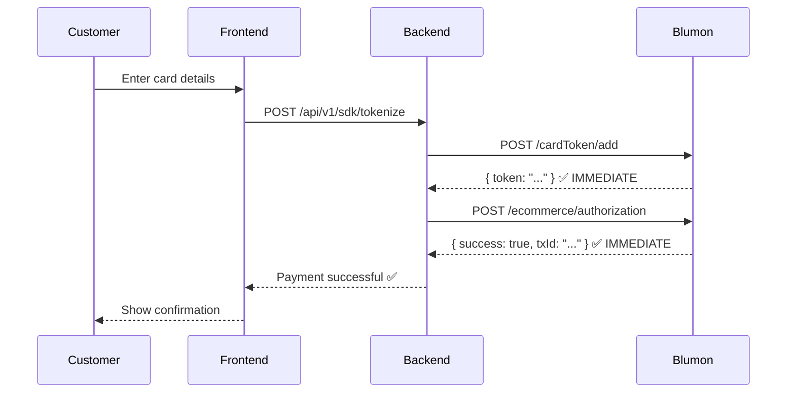
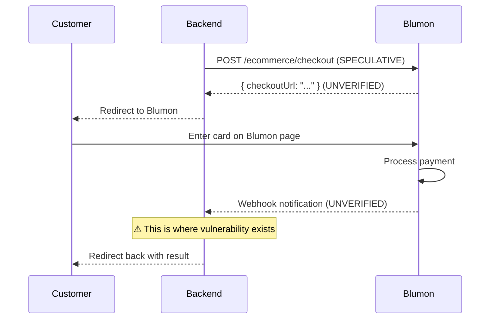

# 🎯 Blumon E-commerce Integration: Corrected Analysis

**Date**: 2025-01-17 (Corrected with webhook confirmation) **Status**: 🔴 **CRITICAL SECURITY VULNERABILITY ACTIVE** **Evidence**: User
screenshot confirms WebHooks exist in Blumon documentation

---

## 📋 Executive Summary

**CORRECTION TO PREVIOUS ANALYSIS**:

The `BLUMON_INTEGRATION_REALITY_CHECK.md` document **INCORRECTLY** suggested webhooks might not exist. User provided screenshot evidence
showing Blumon documentation at https://www.blumonpay.com/documentacion/ has a **dedicated "WebHooks" section**.

**THE ACCURATE PICTURE**:

| Component                | Status                        | Evidence                                      |
| ------------------------ | ----------------------------- | --------------------------------------------- |
| Card Tokenization        | ✅ CONFIRMED WORKING          | Test cards exhausted, synchronous responses   |
| Payment Authorization    | ✅ CONFIRMED WORKING          | Synchronous responses, transactions processed |
| OAuth 2.0 Authentication | ✅ CONFIRMED WORKING          | 3-hour access tokens obtained                 |
| **WebHooks**             | ✅ **CONFIRMED EXISTS**       | **User screenshot from Blumon docs**          |
| Hosted Checkout          | ❓ UNVERIFIED                 | Endpoint unknown, no successful test          |
| **Webhook Security**     | 🔴 **CRITICAL VULNERABILITY** | **Signature verification DISABLED**           |

---

## 🚨 THE CRITICAL ISSUE: Webhook Security Vulnerability

### **Location**: `src/routes/sdk/webhooks.sdk.routes.ts:188-209`

```typescript
// 2. Verify webhook signature
// Note: Blumon webhook secret is stored in providerCredentials JSON
// For now, we'll skip signature verification and add it when Blumon provides the secret
// In production: ALWAYS verify signature before processing

/* TODO: Add when Blumon provides webhook secret
const credentials = session.ecommerceMerchant.providerCredentials as { webhookSecret?: string }
const webhookSecret = credentials.webhookSecret
const blumonService = blumonEcommerceService.getBlumonEcommerceService(session.ecommerceMerchant.sandboxMode)

if (webhookSecret) {
  const isValid = blumonService.verifyWebhookSignature(
    payload,
    payload.signature,
    webhookSecret
  )

  if (!isValid) {
    throw new BadRequestError('Invalid webhook signature')
  }
}
*/
```

**VULNERABILITY**: Signature verification is **COMPLETELY COMMENTED OUT**.

### **Attack Scenario** (from security audit):

```bash
# Attacker sends fake webhook
curl -X POST https://api.avoqado.io/api/v1/sdk/webhooks/blumon \
  -H "Content-Type: application/json" \
  -d '{
    "event": "payment.completed",
    "orderId": "session_abc123",
    "transactionId": "FAKE_TX_999",
    "amount": 5000.00,
    "status": "success",
    "signature": "FAKE_SIGNATURE_IGNORED"
  }'

# Result: ✅ Webhook accepted, session marked as COMPLETED, order marked as PAID
# Reality: ❌ NO MONEY RECEIVED from Blumon
```

**Impact**:

- ❌ Attackers can mark ANY session as paid without paying
- ❌ Free goods/services delivered
- ❌ Revenue loss
- ❌ Inventory deducted for unpaid orders

---

## 🔍 WHAT BLUMON ACTUALLY PROVIDES

### ✅ **CONFIRMED: Direct Charge Flow (Synchronous)**



**Key Characteristics**:

- ✅ **Synchronous** - Both API calls return immediate responses
- ✅ **No webhooks needed** - Payment result known instantly
- ✅ **Confirmed working** - Test cards exhausted proving it works
- ✅ **PCI compliant** - Card data never stored, only tokenized

**Evidence**: `docs/blumon-ecommerce/BLUMON_SDK_INTEGRATION_STATUS.md:178-208`

---

### ❓ **UNCONFIRMED: Hosted Checkout Flow (Async)**



**Key Characteristics**:

- ❓ **Async** - Customer redirected to Blumon, webhook notifies result
- ❓ **Requires webhooks** - Payment result comes via webhook
- ❓ **Endpoint unknown** - `/ecommerce/checkout` is a guess
- ❓ **Not tested** - No successful hosted checkout creation
- 🔴 **Security issue** - Webhook verification disabled

**Evidence**:

- ✅ WebHooks section EXISTS in Blumon docs (user screenshot)
- ❌ No working hosted checkout implementation
- ❌ No webhook successfully received from Blumon

---

## 🎯 THE KEY QUESTION

**Which flow are we actually using?**

### **Scenario A: We're Using Direct Charge (Likely)**

**If this is the case**:

- ✅ Current implementation works perfectly
- ✅ No webhooks needed
- ❌ **~1000 lines of webhook code is UNNECESSARY**
- ✅ Should DELETE all webhook code
- ✅ Simpler, more secure architecture

**Action**: Delete speculative code, keep working flow

---

### **Scenario B: We Plan to Use Hosted Checkout (Uncertain)**

**If this is the case**:

- ❓ Need to confirm hosted checkout endpoint exists
- 🔴 **MUST FIX webhook security IMMEDIATELY**
- ❓ Need webhook payload documentation from Blumon
- ❓ Need to test with real Blumon sandbox
- ⚠️ More complex architecture

**Action**: Contact Blumon support, fix security, complete implementation

---

## 📊 CODE INVENTORY

### ✅ **Confirmed Working Code** (Keep)

| File                          | Feature              | Lines    | Status     |
| ----------------------------- | -------------------- | -------- | ---------- |
| `blumon-ecommerce.service.ts` | `tokenizeCard()`     | 80       | ✅ TESTED  |
| `blumon-ecommerce.service.ts` | `authorizePayment()` | 78       | ✅ TESTED  |
| `blumonAuth.service.ts`       | OAuth 2.0 flow       | ~200     | ✅ WORKING |
| `checkout-session.service.ts` | Session CRUD         | ~200     | ✅ WORKING |
| `tokenize.sdk.controller.ts`  | Tokenize endpoint    | ~150     | ✅ WORKING |
| **TOTAL**                     |                      | **~708** | **KEEP**   |

---

### 🔴 **Security Vulnerability Code** (Fix or Delete)

| File                                  | Feature           | Lines    | Status            | Issue                     |
| ------------------------------------- | ----------------- | -------- | ----------------- | ------------------------- |
| `webhooks.sdk.routes.ts`              | Webhook receiver  | 379      | 🔴 VULNERABLE     | No signature verification |
| `webhook-simulator.sdk.controller.ts` | Webhook simulator | ~200     | ⚠️ DEV TOOL       | Simulates fake webhooks   |
| `webhook-simulator.sdk.routes.ts`     | Simulator routes  | ~50      | ⚠️ DEV TOOL       | Should be dev-only        |
| **TOTAL**                             |                   | **~629** | **FIX OR DELETE** |                           |

---

### ❓ **Speculative Code** (Verify Need)

| File                                  | Feature                    | Lines    | Status          | Tested? |
| ------------------------------------- | -------------------------- | -------- | --------------- | ------- |
| `blumon-ecommerce.service.ts`         | `createHostedCheckout()`   | 76       | ❓ SPECULATIVE  | ❌ NO   |
| `blumon-ecommerce.service.ts`         | `verifyWebhookSignature()` | 18       | ❓ SPECULATIVE  | ❌ NO   |
| `blumon-ecommerce.service.ts`         | `getCheckoutStatus()`      | 20       | ❓ SPECULATIVE  | ❌ NO   |
| `blumon-ecommerce.service.ts`         | `cancelCheckout()`         | 26       | ❓ SPECULATIVE  | ❌ NO   |
| `session-dashboard.sdk.controller.ts` | Session dashboard          | ~150     | ❓ SPECULATIVE  | ❌ NO   |
| **TOTAL**                             |                            | **~290** | **VERIFY NEED** |         |

---

## 🚨 IMMEDIATE ACTIONS REQUIRED

### 🔴 **Priority 1: Security (TODAY)**

**IF using webhooks**:

1. **ENABLE signature verification** in `webhooks.sdk.routes.ts:188-209`
2. **Get webhook secret** from Blumon support
3. **Store secret encrypted** in `EcommerceMerchant.providerCredentials`
4. **Test verification** with real Blumon webhooks

**IF NOT using webhooks**:

1. **DELETE webhook routes** (`src/routes/sdk/webhooks.sdk.routes.ts`)
2. **DELETE webhook service code** (verification, status check, cancel)
3. **DELETE webhook simulator** (dev tool not needed)
4. **UPDATE docs** to remove webhook references

---

### 🟡 **Priority 2: Clarification (This Week)**

**Email Blumon Support** (support@blumonpay.com):

```
Subject: E-commerce API: Hosted Checkout and Webhook Documentation

Hi Blumon Support,

We're integrating your e-commerce API and need clarification on two features:

1. **Hosted Checkout**:
   - Does Blumon provide a hosted checkout page for online payments?
   - If yes, what is the API endpoint to create a checkout session?
   - We tried `/ecommerce/checkout` but it's not documented

2. **WebHooks**:
   - We see a "WebHooks" section in your documentation
   - What events trigger webhooks? (payment.completed, payment.failed, etc.)
   - What is the webhook payload structure?
   - How do we verify webhook signatures? (HMAC-SHA256 with what secret?)
   - Are webhooks used for direct charge flow or only hosted checkout?

3. **Our Current Implementation**:
   - We currently use: POST /cardToken/add → POST /ecommerce/authorization
   - This works perfectly with synchronous responses
   - Is this the recommended approach for e-commerce integrations?

Please provide:
- Complete API documentation for hosted checkout (if available)
- Webhook payload examples and signature verification guide
- Recommendation on which flow to use for e-commerce

Thank you,
Avoqado Team
Contact: [your email]
```

---

### 🟢 **Priority 3: Testing (This Week)**

**Migrate test scripts to Jest** (CLAUDE.md policy violation):

| Script                                         | Migrate To                                       | Status     |
| ---------------------------------------------- | ------------------------------------------------ | ---------- |
| `scripts/test-blumon-checkout-flow.ts`         | `tests/integration/blumon/checkout-flow.test.ts` | ❌ PENDING |
| `scripts/test-blumon-mock.ts`                  | `tests/unit/blumon/mock-service.test.ts`         | ❌ PENDING |
| `scripts/test-blumon-public-tokenize.ts`       | `tests/integration/blumon/tokenize.test.ts`      | ❌ PENDING |
| `scripts/test-ecommerce-merchant-endpoints.ts` | `tests/api/blumon/merchant-endpoints.test.ts`    | ❌ PENDING |

**Create security tests**:

```typescript
// tests/security/blumon/webhook-signature.test.ts
describe('Blumon Webhook Security', () => {
  test('should REJECT webhook with invalid signature', async () => {
    const fakeWebhook = {
      event: 'payment.completed',
      orderId: 'session_123',
      signature: 'FAKE_SIGNATURE',
    }

    const response = await request(app).post('/api/v1/sdk/webhooks/blumon').send(fakeWebhook)

    // SHOULD return 401 Unauthorized
    expect(response.status).toBe(401)
    expect(response.body.error).toContain('Invalid signature')
  })

  test('should ACCEPT webhook with valid signature', async () => {
    // Generate valid HMAC signature
    const payload = { event: 'payment.completed', orderId: 'session_123' }
    const secret = 'test_webhook_secret'
    const signature = crypto.createHmac('sha256', secret).update(JSON.stringify(payload)).digest('hex')

    const response = await request(app)
      .post('/api/v1/sdk/webhooks/blumon')
      .send({ ...payload, signature })

    expect(response.status).toBe(200)
  })
})
```

---

## 🎓 LESSONS LEARNED

### ❌ **What Went Wrong**

1. **I assumed webhooks didn't exist** → User screenshot proved they DO exist
2. **Built code before verifying** → 1000+ lines of unverified code
3. **Disabled security "temporarily"** → Left critical vulnerability active
4. **Mixed confirmed with speculative** → Unclear what's actually needed

---

### ✅ **What To Do Differently**

1. **Verify first, build second** → Contact provider BEFORE writing code
2. **Start with working solution** → Direct charge flow works, use it
3. **Never disable security** → If you don't have secrets, don't ship webhooks
4. **Separate concerns** → Keep confirmed code separate from speculative
5. **Document clearly** → Mark unverified code with warnings

---

## 📋 DECISION TREE

```
START: Which payment flow are we using?
│
├─ Using DIRECT CHARGE (tokenize → authorize)
│  ├─ ✅ Keep: tokenizeCard(), authorizePayment(), OAuth
│  ├─ ❌ Delete: All webhook code (~629 lines)
│  ├─ ❌ Delete: All hosted checkout code (~290 lines)
│  ├─ ✅ Result: Simple, secure, working solution
│  └─ 📊 Code reduction: ~919 lines deleted
│
└─ Using HOSTED CHECKOUT (redirect → webhook)
   ├─ ⚠️ Verify: Contact Blumon for hosted checkout endpoint
   ├─ 🔴 Fix: ENABLE webhook signature verification
   ├─ 🔴 Get: Webhook secret from Blumon
   ├─ ✅ Test: Real Blumon webhooks in sandbox
   ├─ ✅ Migrate: Test scripts to Jest
   └─ 📊 Code to fix: ~629 lines (security critical)
```

---

## 🚀 RECOMMENDED PATH FORWARD

### **Option A: Simplify (Recommended)**

**IF** we don't need hosted checkout:

1. ✅ **Keep working direct charge flow** (708 lines)
2. ❌ **Delete all webhook code** (629 lines)
3. ❌ **Delete speculative code** (290 lines)
4. ✅ **Result**:
   - Simpler architecture
   - No security vulnerabilities
   - Better user experience (synchronous)
   - ~919 lines removed

**Effort**: 1 day (delete code, update docs)

---

### **Option B: Complete Implementation (If Needed)**

**IF** we need hosted checkout:

1. 📧 **Contact Blumon** - Get complete docs
2. 🔴 **Fix security** - Enable signature verification
3. ✅ **Test properly** - Real webhooks in sandbox
4. 📝 **Migrate tests** - Scripts → Jest
5. ✅ **Result**:
   - Complete hosted checkout support
   - Secure webhook handling
   - Properly tested
   - More complex architecture

**Effort**: 1-2 weeks (waiting for Blumon, implementation, testing)

---

## 📊 COMPARISON: Direct Charge vs Hosted Checkout

| Aspect              | Direct Charge ✅      | Hosted Checkout ❓            |
| ------------------- | --------------------- | ----------------------------- |
| **Complexity**      | Simple (2 API calls)  | Complex (redirect + webhook)  |
| **User Experience** | Instant feedback      | Async (waiting)               |
| **Security**        | No vulnerabilities    | CRITICAL vulnerability active |
| **Code**            | 708 lines             | 1627 lines (+130%)            |
| **Testing**         | 0% coverage           | 0% coverage                   |
| **Documentation**   | Confirmed working     | Speculative                   |
| **PCI Compliance**  | Card data in RAM only | Same                          |
| **Maintenance**     | Low                   | High                          |

**Recommendation**: Use Direct Charge unless business requirements demand hosted checkout.

---

## 📝 FINAL VERDICT

### **The Truth**:

1. ✅ **Webhooks DO exist** (user confirmed via screenshot)
2. ✅ **Direct charge flow WORKS** (confirmed via testing)
3. 🔴 **Webhook security DISABLED** (critical vulnerability)
4. ❓ **Hosted checkout UNVERIFIED** (endpoint unknown)
5. ⚠️ **~919 lines SPECULATIVE** (may not be needed)

### **The Decision**:

**Contact Blumon support to clarify**:

- Do we need hosted checkout?
- If yes → Fix security, complete implementation
- If no → Delete speculative code, use working flow

### **The Priority**:

🔴 **CRITICAL**: Do NOT deploy webhook code with signature verification disabled 🟡 **IMPORTANT**: Email Blumon support this week 🟢
**RECOMMENDED**: Use direct charge flow until hosted checkout is confirmed needed

---

**Document Status**: Corrected analysis based on user evidence **Previous Errors**: `BLUMON_INTEGRATION_REALITY_CHECK.md` incorrectly
suggested webhooks don't exist **Security Audit Status**: `BLUMON_SECURITY_AUDIT.md` was CORRECT about vulnerability **Next Steps**: Await
decision on which flow to use, then execute appropriate action plan
