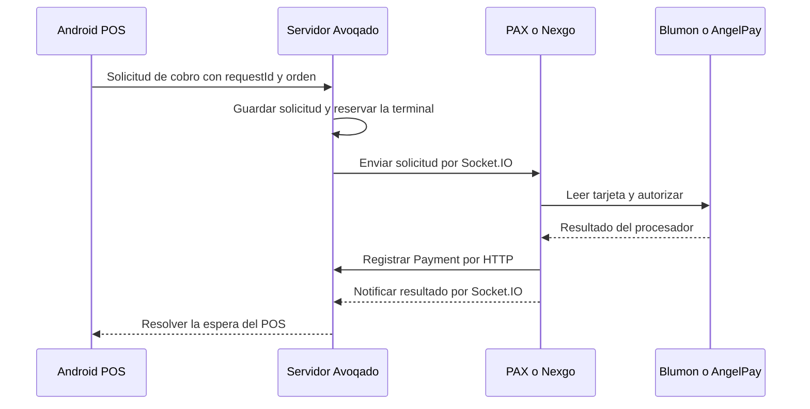

# Testarudo: Android → servidor → TPV y contraste del diagnóstico

Investigación de Codex del 9 de septiembre de 2026. Sólo lectura en producción. El usuario aclaró que aproximadamente 97% de las ventas salen de Android hacia la TPV; no opera Testarudo y no puede confirmar qué pantalla mostraba cada aparato. No se atribuyen acciones concretas al cajero a partir de esa ausencia de observación.

**Dos hallazgos nuevos:** Nexgo perdió su socket 500 ms después del envío del cobro de $308 y su solicitud bloqueó otros cobros remotos durante casi 26 minutos. En el caso PAX de $319, un log durable del mismo intento registra `SaleIccFailure$GenericFailure` después de la primera aprobación Blumon; posteriormente empieza otro PreTrans bajo el mismo identificador, llega una segunda aprobación y sólo ésta se registra. No son pruebas de una causa única para todos los atascos.

## El camino que usa el negocio



La espera Android→servidor es otra petición distinta del POST con el que la TPV registra dinero. El relay espera hasta cinco minutos e incluye interacción humana, lectura, autorización y respuesta; su latencia no puede interpretarse como tiempo de consultas de Postgres.

El 8 de septiembre hay **99 Payments con tarjeta y los 99 tienen vínculo con TerminalPaymentRequest**. Esto verifica el predominio del flujo remoto en ese día; por sí solo el vínculo no identifica el sistema operativo del POS. Las pruebas anteriores de laboratorio fueron Pago rápido iniciado en la propia TPV: no acreditan esta comunicación de punta a punta.

En los cinco días completos del 4 al 8 de septiembre, el cruce actual arroja **500 de 524 Payments con tarjeta vinculados al relay (95.42%)**. El 9 parcial añade diez vinculados. La cifra de Claude, 508/532, usa un corte que no se proporcionó; es compatible con el predominio observado, pero no se presenta como idéntica medición.

## Nexgo $308: desconexión inmediata y bloqueo del relay demostrados

Solicitud `bf771ca0-0b43-4f2f-accf-c52cffed5be0`, orden `cmtt63cab0017pk2b9fzlp552`, terminal `n860w173400`.

| Hora CDMX, log del servidor | Hecho |
|---|---|
| 15:14:10.737386 | Envío único a socket antiguo `0kOc7pgmJNyxn4NGAAAD` |
| 15:14:11.237230 | Desconexión de ese mismo socket: **499.844 ms después** |
| 15:14:32.626673 | Otro envío para la misma orden rechazado: Terminal busy |
| 15:15:08 | Registro de otra orden en efectivo por $280 + $28, según conciliación previa |
| 15:19:10.738793 | La espera original termina en HTTP 504, **300,020 ms** |
| 15:19:11–15:19:13 | Consultas GET del POS sobre la solicitud; además otros dos cobros a Nexgo rechazados por ocupada |
| 15:19:38.009280 | Watchdog cambia la solicitud a UNKNOWN; conserva la reserva |
| 15:40:08.025272 | Liberación automática con AUTO_RELEASED, sin Payment encontrado |

La reserva duró aproximadamente **25 min 57 s**. Aquí sí se documenta por qué Android no podía enviar otros cobros a esa terminal: la solicitud sin resultado retenía su reserva. El archivo AngelPay no contiene venta $308/$280 que la aclare.

> ⚠️ **Nota del 11-sep:** desde el plan D `deliveryAttempts` cuenta ENTREGAS grabadas por `recordDelivery` (también las legacy), ya no ACKs. En filas anteriores al 11-sep contaba ACKs del camino fresco: no comparar filas de antes y de después.

No había ACK de recepción durable en esta solicitud: `deliveryAttempts=0`, `acknowledgedAt=null`, y el log afirma envío legacy. **Cero deliveryAttempts no significa cero envíos**: ese contador sólo se incrementa en la ruta con ACK. El código mantiene entrega única a las APK antiguas; no reentrega automáticamente al reconectarlas.

No consta si la terminal recibió el mensaje antes de desconectarse, ni si abrió el SDK. El handler del servidor recibe `_reason` pero lo descarta al registrar la desconexión; este log no distingue Wi-Fi, reinicio de app, cierre de socket u otra causa. No atribuirlo específicamente a DNS.

## PAX $319: error genérico tras aprobación y segundo intento bajo la misma solicitud

La solicitud POS fue una sola: `39176505-33c1-49f5-9c75-ce652c9e24cb`. El socket `CfWfzp4wqeKZp_ISAAb2` se autenticó a las 13:59:58 y entregó el resultado final a las 14:01:56. En la ventana 13:59–14:04 no apareció desconexión de ese socket ni un segundo envío del relay para esta orden.

| Hora CDMX | Evidencia |
|---|---|
| 14:00:07.417 | Servidor emite una vez la solicitud de $290 + $29 |
| 14:00:13.987 | Recibe TerminalLog: `PHASE 1 PreTrans iniciado` |
| 14:00:15 | Blumon aprueba operación **24237797**, autorización **06875D**, $319 |
| 14:00:49.020 | Recibe TerminalLog: `Autorización rechazada: motivo no extraído` |
| 14:01:09.030 | Recibe otro TerminalLog: `PHASE 1 PreTrans iniciado` |
| 14:01:53 | Blumon aprueba operación **24237873**, autorización **01993D**, $319 |
| 14:01:54.843–14:01:55.206 | POST de registro TPV→Avoqado: 201, 363 ms |
| 14:01:56.924 | Llega resultado socket success para la solicitud original |
| 14:01:56.934 | Espera Android→servidor termina 200, 109.547 s |

Los tres TerminalLogs tienen el mismo `attemptId`: **`ad12bef2-827e-4820-bcf5-418616181bbc`**, que también es la clave idempotente del único Payment. La advertencia contiene:

```text
saleType: SaleIcc (CHIP)
failureClass: com.example.clean_lib_services.shared.core.domain.use_case.sale_package.sale_icc.SaleIccFailure$GenericFailure
descripcion: null
```

IDs de TerminalLog: `cmtt3g90i072vnb2b9is0mz3c`, `cmtt3h01o072znb2boku8ylff`, `cmtt3hfhh0733nb2bwpckbf99`. Se consultaron exclusivamente PaymentTrace, terminal y ventana temporal acotadas.

Las horas TerminalLog de la tabla son de **recepción/persistencia en servidor**, no de ejecución exacta del aparato. Sus timestamps originales son `1788897608942`, `1788897642989` y `1788897666318`; no se interpreta la demora de entrega como tiempo del SDK ni se presupone sincronía perfecta entre relojes.

### Qué significa el mensaje según la versión investigada

En el tag PAX **v2.8.7 / 93e38b2**, `PaymentViewModel.kt`:

- `performOnlineAuthorization` escribe ese mensaje en la rama **saleFailure != null**, no exclusivamente cuando el banco declina. En este caso la clase concreta es GenericFailure; no se extrajo motivo.
- Esa rama devuelve `AuthorizationResult(response=null, ...)` (aprox. línea 4030).
- El llamador, tras `SaleIcc`, convierte la ausencia de respuesta en **PaymentState.Error**, conserva contexto y retorna antes del registro (aprox. línea 3588).
- Error tiene `canRetry=true` por defecto. La pantalla conecta Reintentar con `retryPayment(context)`, que vuelve a iniciar el flujo conservando contexto.
- El estado Error también baja las señales de cobro activo; por tanto, el sistema trata como terminado un intento cuya aprobación en el procesador no conoce.

**Conclusión:** hay evidencia enlazada de la familia de fallo que explica las dos aprobaciones: el procesador aprobó, la aplicación recibió un error genérico de su SDK, lo trató como error reintentable y hubo otra ejecución bajo la misma solicitud remota. El identificador de Avoqado evita duplicar el registro; no demuestra idempotencia del procesador ante dos llamadas de autorización.

No se recuperó la excepción interna de GenericFailure. No se afirma que fuera DNS, timeout HTTP del SDK, error al interpretar la respuesta o CompleteEmvTrans. Tampoco hay un evento UI que pruebe quién tocó Reintentar. La evidencia sitúa el fallo observado en **SaleIcc / autorización online**, posterior a lectura de chip, no demuestra un cuelgue en StartEmvTrans para este caso.

Una consulta Crashlytics topIssues entre 19:59 y 20:03 UTC devolvió tres eventos agrupados en cancelación de coroutine / consulta de turnos; no aportó el GenericFailure de esta PAX. No se atribuyeron esos eventos a Testarudo sin verificar identidad. La evidencia nueva de este apartado proviene de TerminalLog y Better Stack, no de esos samples.

Las dos operaciones siguen apareciendo APROBADAS en el CSV. Determinar un doble cargo liquidado sigue requiriendo detalle de reversos/corte Blumon; esta traza técnica no lo sustituye.

## Cancelar y reenviar: qué confirma y qué no confirma el análisis de Claude

Sobre 4–8 de septiembre, se reproduce exactamente el patrón de filas consecutivas por terminal:

| Terminal | Nueva solicitud <5 s después de updatedAt de una CANCELLED | Mínimo | La anterior trae resultado cancelled de TPV | La anterior no trae resultado |
|---|---:|---:|---:|---:|
| PAX | 61 | 0.625 s | 57 | 4 |
| Nexgo | 1 | 2.795 s | 1 | 0 |

En PAX, 57 de los 61 pares conservan la misma orden. **La métrica empieza en updatedAt del cierre de la fila, no en el toque Cancelar de Android.** En 57 casos ya existe respuesta cancelled de la TPV. Los cuatro sin resultado pueden haberse cerrado por watchdog, más de 30 s después de solicitar cancelación. No es válido describir todos como 61 cancelaciones de tablet ignoradas o 61 reenvíos a ciegas mientras el SDK seguía vivo.

También se verifican cuatro resultados `Ya hay un pago en proceso en el terminal`: PAX 5-sep 10:26:41 y 10:26:55, Nexgo 5-sep 18:27:17, PAX 6-sep 13:42:47. Ninguno es del 8. Demuestran que hubo desacuerdo entre la reserva del servidor y la ocupación que la aplicación TPV percibía; no prueban por sí solos su causa en cada caso.

No hay solapamiento de los intervalos `createdAt`→`updatedAt` de solicitudes consecutivas por terminal en ese corte. Es una comprobación de filas del servidor; **no mide la vida de la autorización bancaria o del SDK**. Dos autorizaciones de la misma solicitud, como los $319, no violan ese candado y quedan fuera de esa métrica.

### La cancelación no libera inmediatamente

En el código servidor revisado (`develop`, servicio sin cambios locales respecto de HEAD):

1. `cancelPayment` emite la petición de cancelación, marca CANCEL_REQUESTED y resuelve la espera HTTP del POS con cancelled/409.
2. CANCEL_REQUESTED **sigue reteniendo** la reserva de la terminal.
3. Si llega un resultado definitivo, cierra la fila. Si no hay Payment y pasan 30 segundos, el siguiente barrido cambia CANCEL_REQUESTED a CANCELLED y libera la reserva.
4. Ese barrido no consulta al procesador para acreditar que no hubo cargo. Android interpreta el estado durable CANCELLED como `NotCharged`.

En PAX v2.8.7, AppNavigation rechaza la cancelación cuando `paymentStateProvider.isCharging()` es true y no emite un resultado de rechazo de cancelación. La señal se abre en la autorización online, no equivale a toda pantalla Processing ni al mero hecho de haber insertado chip. Preservar al receptor del resultado es necesario, pero el servidor no recibe la razón por la que la cancelación no se ejecutó.

Esto confirma un desencuentro de estados. **Añadir un aviso no basta para garantizar que no haya doble cobro** mientras el servidor pueda convertir silencio en CANCELLED y el cliente leerlo como no cobrado. El cambio de estados y la habilitación de reenvíos forman parte del camino de dinero y requieren TDD, integración real y QA con ambos dispositivos.

## Riesgos adicionales de la versión con recepción durable

La versión posterior incorpora inbox Room, ACK, claim y reentrega con capability `terminalPaymentAckVersion=1`. Es una mejora necesaria; no basta con su presencia para declarar seguro el APK. Estos son hallazgos de código pendientes de reproducción, no causas atribuidas a los incidentes legacy:

- **ACK perdido:** servidor espera cinco segundos y ante ACK_TIMEOUT marca FAILED y responde 400 con «No se inició ningún cargo». Pero la TPV pudo persistir, iniciar el flujo y perder sólo la respuesta ACK. Android trata ese 400 como fallo de negocio y permite cobrar otra vez. Ausencia de ACK no prueba ausencia de ejecución.
- **Cancelación persistida antes de decidir si se admite:** `RemotePaymentCoordinator.cancelSocketPaymentRequest` marca RESOLVED/cancelled incluso si AppNavigation rehúsa navegar porque hay dinero en vuelo. `markResolved` impide sobrescribir RESOLVED; un resultado posterior puede dejar de emitirse y el replay conservar cancelled. El registro REST puede reconciliar el servidor, pero esa recuperación no hace correcto el resultado local contradictorio.

El 8-sep, las 108 solicitudes PAX y las primeras 30 Nexgo usaron ruta legacy, sin ACK durable. Sólo la solicitud Nexgo de las 16:45:44 tiene ACK persistido. No se aplican retrospectivamente estos dos riesgos nuevos al caso Nexgo de las 15:14.

## Verificación pendiente antes de corregir o distribuir

No se cambió código de dinero ni se instaló/distribuyó APK. No se avala desde esta investigación «el APK está bien». Las pruebas necesarias deben empezar en Android y recorrer el relay hasta la PAX/Nexgo, con tarjeta sandbox:

- Desconexión tras enviar, distinguiendo solicitud no recibida y ACK perdido después de persistirla.
- Cancelar desde POS antes de tarjeta y durante autorización; comprobar ambos estados visibles y el resultado durable.
- Aprobación del procesador seguida de error/pérdida de respuesta del SDK: conservar incertidumbre y consultar el intento, sin nueva autorización automática ni reintento ciego.
- Registro guardado con respuesta perdida; caída de Android, TPV y servidor; reentrega duplicada con el mismo requestId.
- Verificar una autorización lógica, Payment y saldos coherentes, resultados recuperables y ningún bloqueo sin explicación.

Para cambios: TDD estricto, Postgres real, suite/typecheck por avq-verify y auditoría final. La presente entrega es documental y no declara esas pruebas ejecutadas.

## Evidencia reproducible

- [Consultas Better Stack](./testarudo-2026-09-09-relay.sql), con venue/terminal/solicitud/ventanas explícitos y límites 12–160 filas; todos los resultados por debajo del límite.
- Extracción PG del día 8: 139 solicitudes, límite 301. Extracción 4-sep a 9-sep 09:00 CDMX: 701 solicitudes, límite 1201; cinco días completos analizados aparte. `default_transaction_read_only=on`, statement timeout 10 s, lock timeout 2 s; sin payloads completos ni datos de tarjeta.
- `/tmp/codex-testarudo-20260908/relay-requests-20260908.json`, `relay-requests-audit-20260904-09.json`, `relay-cancel-next-pairs.json`, `relay-319-terminaltrace.json`, y logs sanitizados `relay-target-logs.md`, `relay-nexgo-connection-logs.md`, `relay-319-socket-logs.md`.
- PAX tag v2.8.7 `93e38b2`; TPV publicado HEAD `aea0169`; Android HEAD `dbfc8a4`, lógica de recuperación examinada incorporada en agosto. Los cambios locales de otras sesiones no se trataron como publicados.
- [Conciliación de portales](./testarudo-2026-09-09-conciliacion-portales.md) y [expediente previo](./testarudo-2026-09-08-codex.md).
